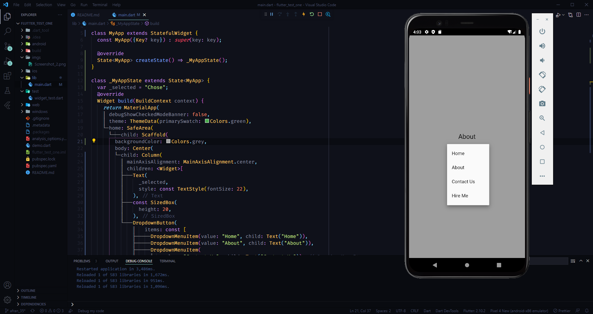

# dropdown button  in flutter

## Copy the code
```dart

  DropdownButton(
      items: const [
        DropdownMenuItem(value: "Home", child: Text("Home")),
        DropdownMenuItem(value: "About", child: Text("About")),
        DropdownMenuItem(
            value: "Contact Us", child: Text("Contact Us")),
        DropdownMenuItem(value: "Hire Me", child: Text("Hire Me")),
      ],
      onChanged: (val) {
        setState(() {
          _selected = val.toString();
        });
      })

```


## ScreenShort

