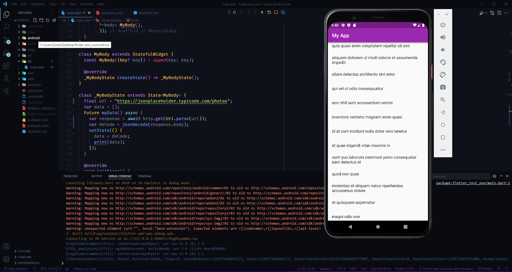

# http package In Flutter

## How to use
> <b> Installation :</b>
> - include *http* package on **pubspec.yaml**
> - make a stateful widget


## Copy the code
```dart

  var data = [];
  Future getData() async {
    var response =
        await http.get(Uri.parse("https://jsonplaceholder.typicode.com/posts"));
    setState(() {
      var decode = jsonDecode(response.body);
      data = decode;
      print(data);
    });
  }

  @override
  void initState() {
    super.initState();
    getData();
  }

```

> - You have got all the data *"data"* in variable
> - And you can see that in terminal

> ## Why we are useing *initState()* Method
> For *initState()* Method, *"getData()"* function call when the app has started

## showing the data in your app,copy the code
```dart

ListView.builder(
        itemCount: data == null ? 0 : data.length,
        itemBuilder: (contex, index) {
          return ListTile(
            title: Text(data[index]["title"]),
            subtitle: Text(data[index]["body"]),
          );
        },
    ),

```


>## Important note
> - Use async function
> - *http.get()* can't receive any String so, pass in *Uri.parse()* method
> - Use *await* because it's a async function
> - Use *initState()* method so that call the function when app is running
> - Text(**data**[index]["title"]) ,All data contain *data* variable


## Dependencies:
- curved_navigation_bar: ^1.0.3


