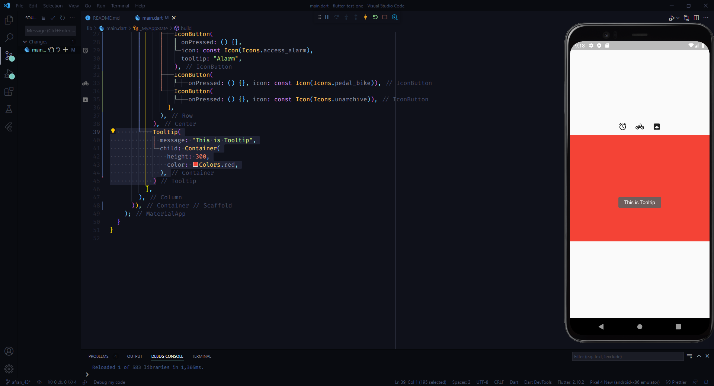

# Tooltip  in flutter

## Copy the code
```dart

import 'package:flutter/material.dart';

void main() => runApp(MyApp());

class MyApp extends StatefulWidget {
  const MyApp({Key? key}) : super(key: key);

  @override
  State<MyApp> createState() => _MyAppState();
}

class _MyAppState extends State<MyApp> {
  bool checked = true;
  @override
  Widget build(BuildContext context) {
    return MaterialApp(
      debugShowCheckedModeBanner: false,
      home: Scaffold(
          body: Container(
        child: Column(
          mainAxisAlignment: MainAxisAlignment.center,
          children: [
            Center(
              child: Row(
                mainAxisAlignment: MainAxisAlignment.center,
                children: [
                  IconButton(
                    onPressed: () {},
                    icon: const Icon(Icons.access_alarm),
                    tooltip: "Alarm",
                  ),
                  IconButton(
                      onPressed: () {}, icon: const Icon(Icons.pedal_bike)),
                  IconButton(
                      onPressed: () {}, icon: const Icon(Icons.unarchive)),
                ],
              ),
            ),
            Tooltip(
              message: "This is Tooltip",
              child: Container(
                height: 300,
                color: Colors.red,
              ),
            )
          ],
        ),
      )),
    );
  }
}

```


## ScreenShort

